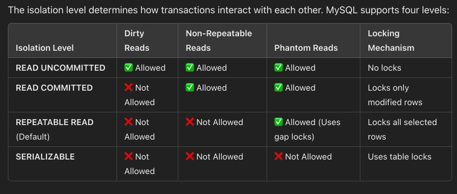

## Introduction to MySQL
MySQL is a mature, relational database management system (RDBMS) known for its robustness, widespread adoption, and strong adherence to SQL standards. It is a popular choice among engineers for managing structured data due to its ACID-compliant transactions, well-defined schema, and powerful query capabilities.

### Strengths
- **Structured Data and Relationships**
- **ACID Compliance**: MySQL provides full ACID (Atomicity, Consistency, Isolation, Durability) properties, ensuring reliable transactions and data integrity, which is critical for financial, e-commerce, and other mission-critical applications
- **Mature Ecosystem and Tooling**
- **Standardized Query Language**

### Weaknesses Compared to NoSQL Databases
- **Scalability Challenges**: While MySQL can scale vertically (by adding more resources to a single server), horizontal scaling (distributing data across multiple servers) can be more challenging compared to many NoSQL solutions
- **Flexibility with Schema**: MySQL enforces a rigid schema, which can limit flexibility when dealing with rapidly changing data models or unstructured dat
- **Handling Big Data and High Write Loads**: For applications that require high throughput for write-heavy workloads or need to handle massive amounts of unstructured data, NoSQL databases like Cassandra or MongoDB may offer better performance
- **Complexity in Sharding**: Implementing sharding or distributed architectures in MySQL can be complex and may require additional middleware or significant architectural overhead


MySQL offers a reliable, well-understood platform for managing structured data with strong consistency guarantees and robust transactional support. However, when dealing with applications that require dynamic schema evolution, massive horizontal scalability, or high-velocity data ingestion, NoSQL databases might provide a more natural fit.

## The Code Challenges

### Coupon System for Doordash or Uber Eats
Assume you are designing a coupon system for Doordash or Uber Eats. 
- The restaurant owners can create promotions, and in each promotion, there is a maxiumum number of allowed coupons;
- The users can browse promotions, and sign up for the promotions. The sign-up gives coupons to users. A user can sign up once for one promotion;
- A user can browse her/his available coupons.

Coding template: [challenge_coupons.py](./challenge_coupons.py), and you only need to implement specific functions; you can find my solution at [solutions/challenge_coupons.py](./solutions/challenge_coupons.py)

Before starting, please read the [How to Use section](#how-to-use), and the [Python SQL client documentation section](#python-sql-client-documentation).

## How to use?

1. in a terminal tab, start the MySQL docker server using:
```
$ docker compose up
```
2. in another tab of terminal, start virtual environment and run the code
```
$ bash start_env.sh
$ python3 challenge_coupons.py
```

It is possible to check the table inside the docker container too:
```
$ docker exec -it mysql  bash

# Now you are inside the container
$ mysql --password=example
# Now you have an interactive SQL client
mysql> SELECT 1;
```


## Resources

### Python SQL client documentation
- [PyMySQL](https://pymysql.readthedocs.io/en/latest/user/examples.html) is used here; however, the documentation is minimum and not very useful
- [psycopg 3](https://www.psycopg.org/psycopg3/docs/basic/usage.html) for PostGres; the instruction is very detailed and you can use for reference.

Key points:
- by default, connection does not commit automatically (though we can change this behavior by setting `autocommit=True`); we have to call `conn.commit()` to make it visible to others (or, persistent in storage), or call `conn.rollback()` to rollback;
- any pending operations before `conn.commit()` are handled as one transaction;

A typical usage:
```
conn = pymysql.connect(host='localhost',...)

with conn.cursor() as cursor:
  # the following SQL1 and SQL2 are executed as one transaction
  try:
    cursor.execute(SQL1)
    cursor.execute(SQL2)
    conn.commit()
  except DB_ERROR:
    conn.rollback()
```

### Key APIs

#### Connection Object
- `close()`: Close the connection now
- `commit()`: Commit any pending transaction to the database.
- `rollback()`: causes the database to roll back to the start of any pending transaction. Closing a connection without committing the changes first will cause an implicit rollback to be performed.
- `cursor()`: Return a new Cursor Object using the connection.

#### Cursor Objects
- `execute(query [, params])`
  - `query`: The query to execute.
  - `params` (Sequence or Mapping): The parameters to pass to the query, if any
- `fetchone()`: Return the next record from the current recordset, in the format of dictionary.
- `fetchall()`: Return all the remaining records from the current recordset, in the format of a list of dictionaries.

### [Optional] Optimize the use of indexing
[Use the Index Luke](https://use-the-index-luke.com/).

- **Maintenance Overhead**: Indexes incur an update cost because they must be maintained during insert, update, or delete operations. Avoid over-indexing to prevent unnecessary performance overhead.

- **Execution Process**: Query execution involving indexes generally occurs in two phases: first, <ins>index reads</ins> are performed to locate the relevant entries, and then <ins>table reads</ins> retrieve the actual row data.

- **Selective Indexing**: Avoid indexing columns with sparse or broad values (e.g., department IDs). Indexes on such fields tend to result in many <ins>table reads</ins> and, in some cases, numerous <ins>index reads</ins>, diminishing their benefit.

- **Function Usage in WHERE Clauses**: Do not apply functions (such as UPPER or date/time operations) on indexed columns within the WHERE clause, as this will disable the index. If function-based indexing is required, create a dedicated function-based index.

- **Multiple Indexes in WHERE Clauses**: When multiple indexed fields are used in the WHERE clause, typically only one index is chosen by the query optimizer. As a best practice, consider placing the most specific or selective condition first (or leftmost) in the clause. Alternatively, a concatenated index that combines multiple fields can sometimes be more effective.

- **Impact of LIKE Clauses**: The use of the LIKE clause, particularly with wildcards at the beginning of the search term, can disable the effectiveness of indexes. Some databases might still use the index if the wildcard is at the end (a prefix search), but generally, pattern matching can hinder index utilization.

### [Optional] Transaction vs Locking

By default:
- transaction enforces atomicity of different operations from the same client; all the operations are either committed together or rolled back together. It does not prevent other clients from making change in between
- locking enforces exclusive access of the same record. It is used to prevent the concurrent access of the same record from different clients.

However, by default, the transaction in MySQL enforces the row locking: it locks all the rows the SQL selects. However, it does not lock the whole table, and without table lock, phantom read is possible.
- what is phantom read? A phantom read occurs when a transaction reads a set of rows, but when it re-reads the same query later within the same transaction, new rows unexpectedly appear (or disappear) due to another transaction inserting or deleting data.

To given concrete examples, 

- case 1: in the following code, no other clients can change the account for id 1 and the account for id 2.
```
START TRANSACTION;  -- Begin a new transaction
UPDATE accounts SET balance = balance - 100 WHERE id = 1;
UPDATE accounts SET balance = balance + 100 WHERE id = 2;
COMMIT; 
```
- case 2, in the following code, the two statements may return different values because of phantom reads.
```
START TRANSACTION;  -- Begin a new transaction
SELECT count(*) from accounts WHERE balance > 1000;
SELECT count(*) from accounts WHERE balance > 1000;
COMMIT; 
```

Here is more explanation: [MySQL isolation levels and how they work](https://planetscale.com/blog/mysql-isolation-levels-and-how-they-work)


