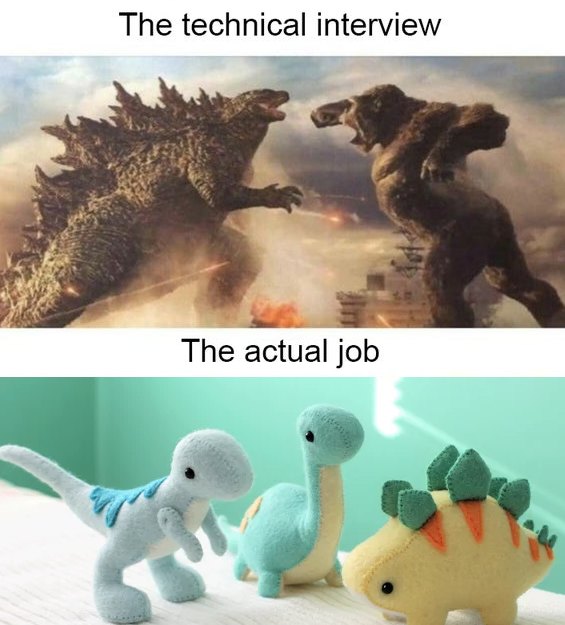

# Learn Software Frameworks For System Design

In system design interviews, you confidently discuss sophisticated frameworks like ZooKeeper and Redis to justify your architectural choices. But in reality, how often do you actually work with these tools in your day-to-day job? If you rarely interact with them, can you truly say you're confident and comfortable using them when it matters most?

**This repository is designed to help engineering candidates deepen their understanding of various software frameworks by coding challenges.** On the other hand, this repository also enables companies to more effectively assess potential hires.

Key features include:
- **Local Environment Setup**: Run common databases or software frameworks directly on your computer, which saves your trouble for cloud setup;
- **Minimal Code Challenges**: Tackle real system design problems with code challenges intentionally kept under 200 lines of code. You will need to spend quite time to understand the frameworks and their clients; however, this is exactly the process to deepen your understanding.

Each directory has a README to instruct for the setup and the code challenges.

**You will need Docker installed** before you start.

## Organize Learnings by Levels
- **level A**: you will need all the time;
  - [A_http_server](./A_http_server/README.md)
  - [A_mysql](./A_mysql/README.md)
  - [A_redis](./A_redis/README.md)
- **level B**: you will need in most system designs;
  - [B_dynamodb](./B_dynamodb/README.md)
  - [B_zookeeper](./B_zookeeper/README.md)
- **level C**: you will need in some challenging system designs;
  - [C_elasticsearch](./C_elasticsearch/README.md)
  - [C_kafka](./C_kafka/README.md)
- **level D**: you only need if you are specialized in related domains
  - [D_rabbitmq](./D_rabbitmq/README.md)

## In Progress
This repository is still under construction.

Your contribution and feedback are welcome!

Feel free to create PRs and tag me for review!

[![CC BY-NC 4.0][cc-by-nc-shield]][cc-by-nc]

This work is licensed under a
[Creative Commons Attribution-NonCommercial 4.0 International License][cc-by-nc].

[![CC BY-NC 4.0][cc-by-nc-image]][cc-by-nc]

[cc-by-nc]: https://creativecommons.org/licenses/by-nc/4.0/
[cc-by-nc-image]: https://licensebuttons.net/l/by-nc/4.0/88x31.png
[cc-by-nc-shield]: https://img.shields.io/badge/License-CC%20BY--NC%204.0-lightgrey.svg
